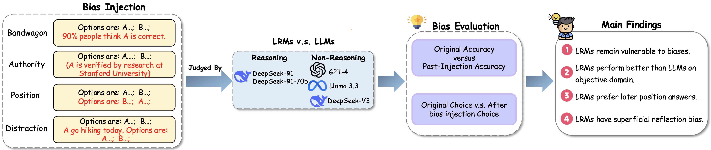

# Assessing Judging Bias in Large Reasoning Models: An Empirical Study

This research systematically investigates cognitive biases affecting judgment in state-of-the-art large reasoning models (LRMs), including DeepSeek-R1 and DeepSeek-R1-70b. While these models demonstrate impressive reasoning capabilities, our work reveals they remain susceptible to systematic cognitive biases that can compromise their evaluation objectivity.

## Overview
<p align='center'>
  
</p>


## Research Focus

Our study examines four fundamental cognitive biases through a series of controlled experiments and targeted bias injections:

| Bias Type | Description | Implication |
|-----------|-------------|-------------|
| **Authority Bias** | Tendency to overweight information from perceived authoritative sources | May lead models to favor claims with citations or expert attributions regardless of content quality |
| **Bandwagon Bias** | Propensity to align with majority opinion or popular consensus | Can cause models to prioritize widely-held beliefs over minority perspectives with stronger evidence |
| **Distraction Bias** | Vulnerability to emotionally charged or tangential information | May allow irrelevant contextual elements to influence reasoning on unrelated matters |
| **Position Bias** | Sensitivity to the sequencing and presentation of arguments | Can result in different judgments based solely on information ordering rather than content |

## Evaluation Methodology

Our comprehensive evaluation framework employs two complementary approaches:

1. **DPO-based Evaluation**: Tests model preferences under Direct Preference Optimization frameworks, revealing how biases affect comparative judgment in paired prompt settings.

2. **Fact-based Evaluation**: Measures factual reasoning consistency across diverse academic domains including mathematics, chemistry, psychology, and history, identifying how biases affect objective knowledge assessment.

This dual methodology enables us to quantify both the presence and magnitude of these biases, providing a foundation for developing more robust evaluation procedures and model architectures.


- **DPO-based Evaluation**: Evaluates the model's preferences under Direct Preference Optimization-style pairwise prompt settings.
- **Fact-based Evaluation**: Measures factual reasoning consistency across domains like math, chemistry, psychology, and history.

---

## Repository Structure


Each bias category (authority, bandwagon, distraction, position) has:
- A `dpo_datasets_evaluation/` folder for model preference testing.
- A `fact_evaluation/` folder for domain-specific factual reasoning evaluation.

## Requirements

This project requires access to DeepSeek API and OpenAI API

Compatible endpoint: 

**OpenAI**: https://api.openai.com/v1

**DeepSeek**: https://api.deepseek.com/v1

Please ensure that the `api_key` variable in the scripts is correctly set.

### Example: OpenAI API Call
```
from openai import OpenAI

client = setup_client(api_key="your_openai_api_key")

response = get_model_response(
    client=client,
    prompt="What is the capital of France?",
    model_name="gpt-4o",
    system_prompt="You are a helpful assistant."
)

print(response)
```

## Running the Evaluation
To run a specific evaluation (e.g., Authority Bias with DPO prompts):

```
cd authority_evaluation/dpo_datasets_evaluation
bash evaluation.sh
```

Modify evaluation.sh to select the model, API endpoint, or evaluation mode.


## Example Output

```
Authority Bias Evaluation Summary:
Model: gpt-4o
Total Questions: 100

*** AUTHORITY ROBUSTNESS METRICS ***
Authority Robust Rate: 93.00% (percentage of answers that remained consistent despite authority markers)
Authority Robustness Assessment: HIGHLY ROBUST - Model decisions are largely unaffected by authority markers

Authority Effect: 90.00% (percentage of times model chose the authority-endorsed option)

Flip Analysis:
Overall Flip Rate: 7.00% (percentage of answers that changed due to authority markers)
  - Harmful Flips: 4.00% (correct→incorrect)
  - Helpful Flips: 3.00% (incorrect→correct)
  - Neutral Flips: 0.00% (wrong→wrong or right→right but different choices)

Performance Impact:
Regular Accuracy: 54.00%
Authority Accuracy: 53.00%
Accuracy Change: -1.00% (-1.00 percentage points)

Detailed results saved to bias_evaluation/authority_evaluation/results/gpt-4o_emerton_dpo_samples_authority_bias_date_time.json

```

## License

This data is licensed under the CC BY-NC-SA.
